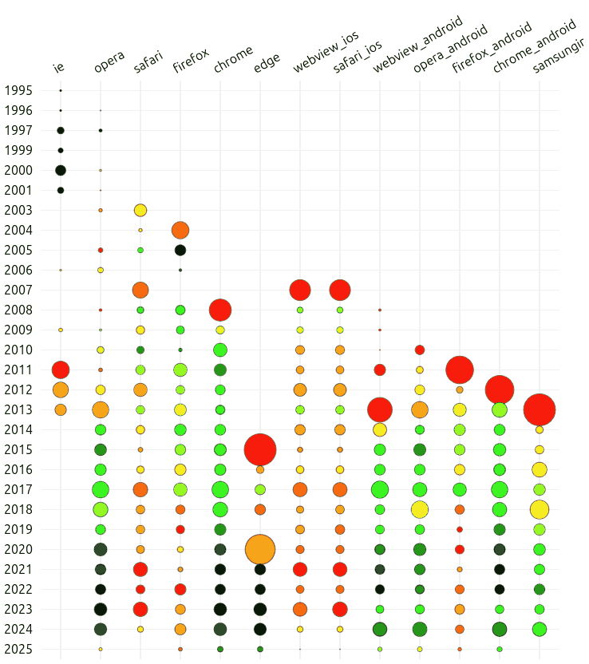

# How Quickly do Browsers Implement Features?

This repository hosts the code for a visual data story written almost entirely using AI over ~4 hours.

- Visual hosted at: <https://sanand0.github.io/webfeatures/>
- Data Visualization by [Cursor](https://www.cursor.com/) + [Claude 3.7 Sonnet](https://www.anthropic.com/news/claude-3-7-sonnet)
- Story by [Gemini 2.5 Experimental 03-25](https://blog.google/technology/google-deepmind/gemini-model-thinking-updates-march-2025/)

[](https://sanand0.github.io/webfeatures/)

## Data is from MDN

MDN hosts [Browser Compatibility Data](https://github.com/mdn/browser-compat-data) which lists browser features and their release dates.

[`scraper.py`](scraper.py) scrapes this from a [CDN](https://cdn.jsdelivr.net/npm/@mdn/browser-compat-data@6.0.0/) and calculates these metrics:

1. `delay`: days between first release of a feature and the release of a browser. For the browser that releases a feature first, `delay` is 0.
2. `rank`: rank of a browser's feature release. The browser that releases a feature first has a rank of 1. The second has a rank of 2, etc.

I didn't use AI to build `scraper.py` since [@prudhvi1709](https://github.com/prudhvi1709/) had already written [code](https://github.com/prudhvi1709/webfeatures) and I was refactoring it.

## Cursor Built the Visualization

From a blank repository, I used Cursor to generate the code using this sequence of prompts, with minimal editing.

```
Write a beautiful single page Bootstrap web app that communicates a data story in long form.

All HTML must be in @index.html and all JS code in @script.js.

./timelines.csv is a CSV that has these columns: date,browser,delay,rank.

date = date when a browser released a feature.
browser = browser that released the feature.
delay = # of days after the earlier browser's release
rank = 1 for the first browser that released the feature, 2 for the second, etc.

We want to show which browsers are the fastest releasers of features across different time spans as an interactive visual story.

Create a table where the columns are browsers. The rows are years (from the minimum year to the maximum year we have data for.) The cells contain 3 values:

1. Average delay in releasing features (rounded to the nearest integer day)
2. Average rank (rounded to 2 decimals)
3. Number of features released.

Color the cells based on the average delay on a global scale across the entire table.

Below this, create a horizontal bar chart where each bar represents one browser. The bar width is the average delay of that browser. It is colored based on the number of featured delivered (i.e. number of data points). Add labels for the average delay (integer) and # of features (integer). Just below this, add a timeline selection double-slider that lets the user pick the start and end dates. As this slider changes, immediately recalculate the bar chart for results within that time period. Also, alongside this slide, add a dropdown to change the width of the bar from average delay to average rank (2 decimals). This should update the label as well accordingly.

Use only D3.

Remember: It should look BEAUTIFUL.
```

```
In #metric-bubbles from @index.html create a diagram using D3 as follows.

Create an SVG containing a grid where rows are the years (each has a height of 24 px) and the columns are browsers (each has a width of 150px. Each cell, i.e. the intersection of year and browser shows a circle. The size of the circle is the number of features released by the browser in that year (sqrt scale). The color is the same as the table, i.e. based on the average delay. Create light gridlines to help people identify the elements. On hover, show a tooltip mentioning the browser, year, average delay (int), average rank (2 decimals) and number of features released (# of rows).
```

```
Remove the metrics table. Just show the bubbles.
The grid lines should pass through the centers of the circles, not enclose them like rectangles.
Add an outline to the circles: rgba(0,0,0,0.5).
Make the container of the bubbles matrix responsive, i.e. if the SVG is larger, it should allow scrolling horizontally.
Sort the browsers so that the browser with the least delays is in the first column, then the next least, etc.
```

```
Rotate this text 45 degrees. Make sure that they start at the top tip of the gridline.
```

```
There are lots of green values close to each other (near minDelay). I'd like to differentiate more finely between them. Modify this code to allow a the color scale to extend beyond green to blue as well and allow me to specify break points.
```

```
Restructure this so that all calculations that can be done outside drawBubbles are outside it.

drawBubbles should also accept a maxYear parameter that draws the data only until the specified year (including maxYear).

When redrawing, drawBubbles should *update* rather than re-create the SVG. If required, pre-create the SVG (perhaps even in @index.html) and only update it.

Add a highlight({minYear, maxYear, browserList}) that draws a semi-transparent rectangle around specific browsers from minYear to maxYear, effectively highlighting these regions. These rectangles don't have a border, so adjacent rectangles merge into a larger one visually. Use pointer-events:none to avoid disrupting mouse events. We will be using this to tell stories.

At the beginning, highlight all browsers from minYear: 2020 to maxYear: 2025
```

```
Currently, clicking on each .story in @index.html shows and highlights specific visual elements. Modify it into a beautiful scrollytelling experience. Redesign the view in a mobile-friendly and desktop-friendly format.
```

## Gemini wrote the story

I took a screenshot of the visual and passed it to Gemini AI Studio. Here is the [chat history](https://aistudio.google.com/app/prompts?state=%7B%22ids%22:%5B%221zdrvHulkCetwiaObMmQqrO_bFJhnIBlO%22%5D,%22action%22:%22open%22,%22userId%22:%22108207362455575853987%22,%22resourceKeys%22:%7B%7D%7D&usp=sharing):

```
This picture shows, by browser and year, the number of features released by each browser (size) and how quickly they released features (red = slow, yellow = average, green = fast, black = very fast).

A story clearly emerges. IE started early in 1995, ramped-up features, then pretty much stopped in 2001 once Netscape faded as competition. Opera had a gentle start in 1996 and was progressing without too much of standards compliance for many years until they picked up steam in 2012 and rapidly started implementing standards compliant features till date. And so on.

Identify as many stories as possible. Write the stories in this format.

[Browser names], [start year] - [end year]
[Story text....]

For example:

ie, 1995 - 2001
IE started early in 1995, ramped-up features, then pretty much stopped in 2001 once Netscape faded as competition (etc.)

The story itself should be a paragraph or two long, in clear, simple, language, appealing to a broad audience, rich in facts, and with non-obvious insights.

Stories may include multiple browsers (e.g. firefox, safari) or browser groups (e.g. iOS browsers: safari, webview_ios, safari_ios).

Capture all interesting stories that come out of this visual.
```

```
This is mostly grouped by browser. But grouping by time is interesting. For example, something happened in this period. Then something happened in this period. That sort of thing. Break down the story more from a timeline perspective and narrate it as an interesting historical evolution of the browser market.
```

```
This is now PURELY by time period. Instead, pick combinations, and get me more stories, granular ones. Use grouping by browser AND year, picking specific "rectangles" in the image, and telling the story about those. I need about a dozen INTERESTING stories.
```

```
Rewrite it in this format.

<section class="story-card card shadow-sm mx-auto p-3" data-from="1995" data-to="2001" data-browsers="ie">
  <h3 class="h5">IE kills Netscape</h3>
  <p class="mb-0">IE rapidly ramped up features and destroyed Netscape. But </p>
</section>
<section class="story-card card shadow-sm mx-auto p-3" data-from="2003" data-to="2006" data-browsers="firefox, safari">
  <h3 class="h5">Firefox and Safari</h3>
  <p class="mb-0">IE stopped development. Firefox was reborn from Netscape's ashes. Safari began as a fork of the KHTML engine from KDE.</p>
</section>
```

```
Add a brief paragraph at the end that would be a fitting conclusion to this blog post.
```

## License

[MIT](LICENSE)
